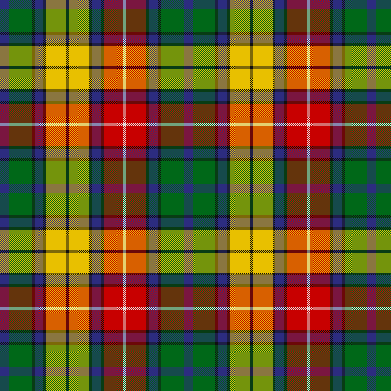

# tartan-maker

[](https://github.com/k3jph/stops-el)
[](https://jameshoward.us)

[](https://github.com/k3jph/tartan-maker/actions/workflows/ci.yml)
[](https://k3jph.github.io/tartan-maker/)
[](https://pypi.org/project/tartan-maker/)
[](https://pypi.org/project/tartan-maker/)
[](LICENSE)
[](https://docs.astral.sh/ruff/)

`tartan-maker` is a Python package and command-line utility for defining, validating, rendering, and exporting tartan designs from YAML.

It is deliberately **SVG-first**: the package builds clean SVG from structured tartan data, and PNG output is derived from that same SVG. One rendering model, one source of truth, no separate raster engine slowly wandering off into the moor.

<p align="center">
  
  
  
</p>

## What it does

- Defines tartans as readable YAML.
- Supports symmetrical setts with explicit pivot markers.
- Supports asymmetrical/direct setts without pivot markers.
- Validates palettes, threadcounts, pivots, unused colors, and repeat sizes.
- Renders SVG with separate warp and weft threadcount groups.
- Exports PNG through the optional CairoSVG backend.
- Emits Scottish Register of Tartans-style `Pallet:` and `Threadcount:` fields.
- Resolves web color names and hex colors.
- Uses `spdlog` for CLI logging.

## Installation

For local development:

```bash
pip install -e .
```

For PNG export support:

```bash
pip install -e ".[png]"
```

For development tools:

```bash
pip install -e ".[dev,png]"
```

## Quick start

Render one of the bundled examples:

```bash
tartan-maker render examples/black-watch-government.yaml -o black-watch.svg
```

Render PNG instead:

```bash
tartan-maker render examples/royal-stewart.yaml -o royal-stewart.png
```

Inspect a tartan:

```bash
tartan-maker inspect examples/buchanan.yaml
```

Generate SRT-style fields:

```bash
tartan-maker srt examples/macleod-of-lewis.yaml
```

Check the installed version:

```bash
tartan-maker --version
```

## Documentation

The project site is built with MkDocs and published through GitHub Pages:

```bash
pip install -e ".[png]"
pip install mkdocs mkdocs-material mkdocstrings[python]
mkdocs serve
```

The docs workflow runs the unit tests on every commit and publishes the site on pushes to `main`.

## Examples

The `examples/` directory contains reference encodings used for testing and demonstration:

| File | Sett type | Source |
| --- | --- | --- |
| `black-watch-government.yaml` | symmetrical | Scottish Register of Tartans ref. 277 |
| `balmoral-original.yaml` | symmetrical | Scottish Register of Tartans ref. 182 |
| `rob-roy-macgregor.yaml` | symmetrical | Scottish Register of Tartans ref. 3516 |
| `buchanan.yaml` | asymmetrical | Scottish Register of Tartans ref. 414 |
| `royal-stewart.yaml` | symmetrical | Scottish Register of Tartans ref. 3958 |
| `macleod-of-lewis.yaml` | symmetrical | Scottish Register of Tartans ref. 2630 |

These examples are not original design filings. They are practical sample inputs for exercising the parser, validator, renderer, and exporter.

## Development

Run the tests:

```bash
python -m pytest -q
```

Run the linter if installed:

```bash
ruff check .
```

Build release distributions:

```bash
python -m build
```

See `CONTRIBUTING.md` for the development checklist and `CHANGELOG.md` for release history.

## License

MIT. See `LICENSE`.
