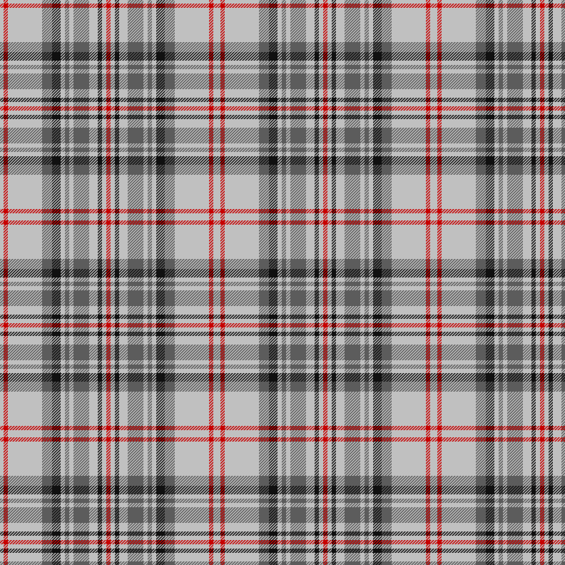
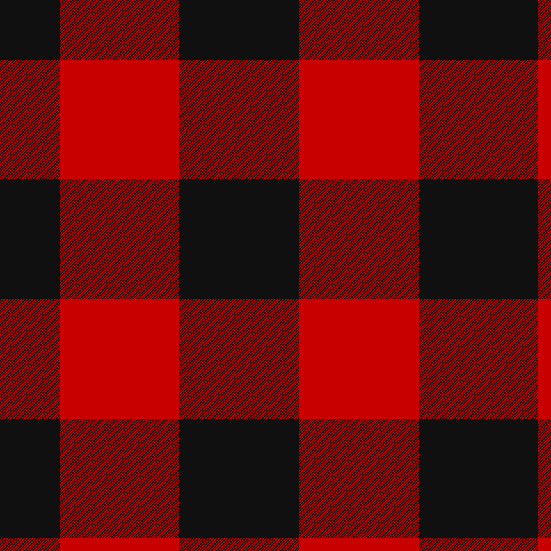
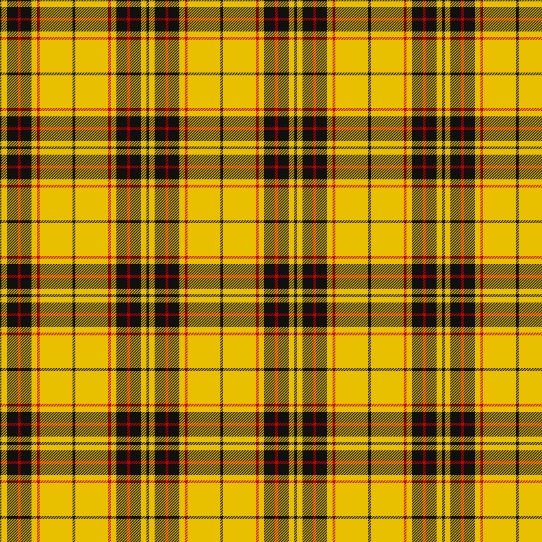

# Examples

The repository includes six example tartan specifications in `examples/`.

These files are sample inputs for the parser, validator, renderer, and SRT exporter. They are not original design filings.

## Black Watch / Government


```bash
tartan-maker render examples/black-watch-government.yaml -o black-watch-government.svg
```

## Balmoral Original



```bash
tartan-maker render examples/balmoral-original.yaml -o balmoral-original.svg
```

## Rob Roy MacGregor



```bash
tartan-maker render examples/rob-roy-macgregor.yaml -o rob-roy-macgregor.svg
```

## Buchanan


Buchanan is the useful asymmetrical example: the full/direct repeat is encoded in order without pivot markers.

```bash
tartan-maker render examples/buchanan.yaml -o buchanan.svg
```

## Royal Stewart


```bash
tartan-maker render examples/royal-stewart.yaml -o royal-stewart.svg
```

## MacLeod of Lewis



```bash
tartan-maker render examples/macleod-of-lewis.yaml -o macleod-of-lewis.svg
```

## Summary

| File | Sett type | Source |
| --- | --- | --- |
| `black-watch-government.yaml` | symmetrical | Scottish Register of Tartans ref. 277 |
| `balmoral-original.yaml` | symmetrical | Scottish Register of Tartans ref. 182 |
| `rob-roy-macgregor.yaml` | symmetrical | Scottish Register of Tartans ref. 3516 |
| `buchanan.yaml` | asymmetrical | Scottish Register of Tartans ref. 414 |
| `royal-stewart.yaml` | symmetrical | Scottish Register of Tartans ref. 3958 |
| `macleod-of-lewis.yaml` | symmetrical | Scottish Register of Tartans ref. 2630 |
